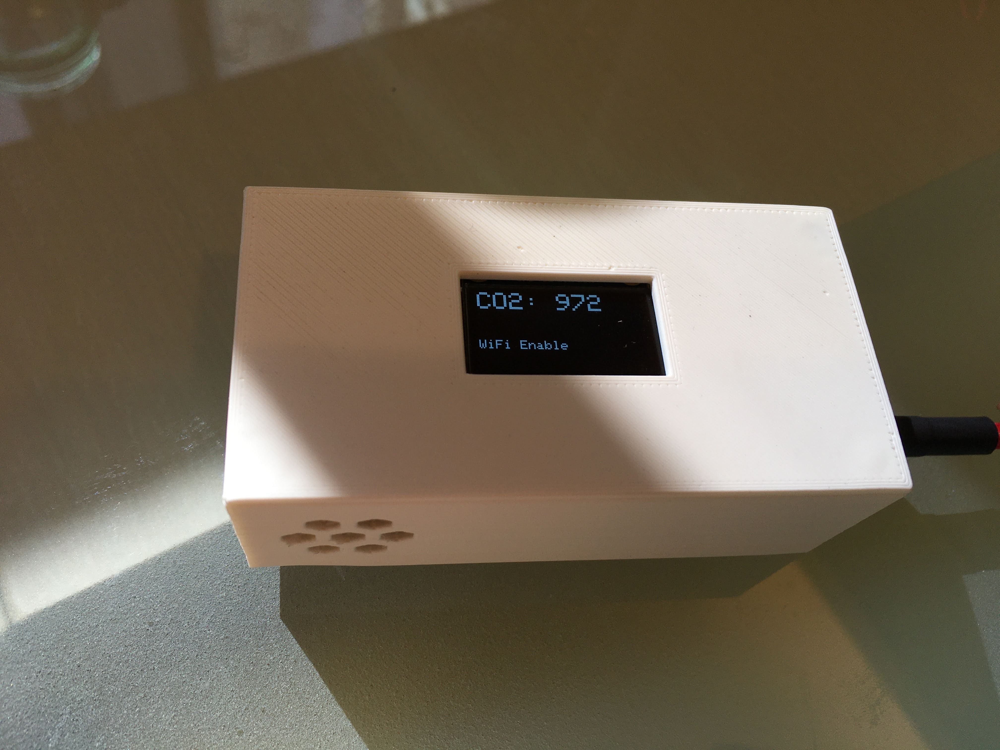
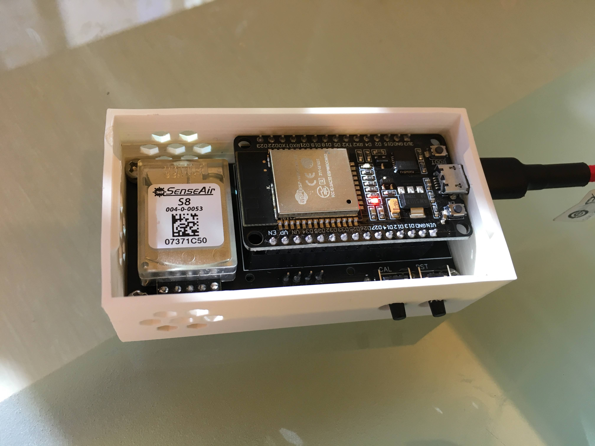
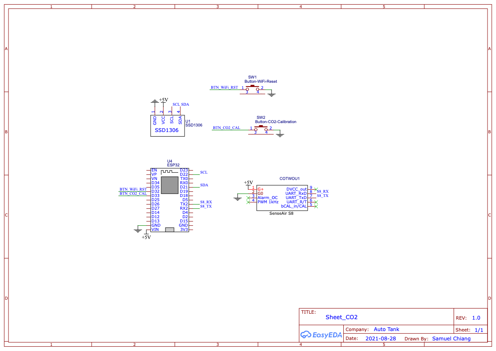
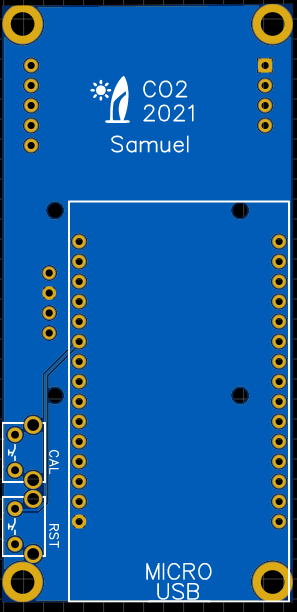

# ESP32_CO2_Sensor
Use ESP32 to read CO2 sensor and publish it by MQTT

## Features
- ESP32 can read the sensor data.
- ESP32 can publish the sensor data by MQTT
- Calibration button
	- Place outdoor with fresh air for a while, short pressed for calibration to 400 ppm.
- WiFi button
	- Short pressed WiFi to turn on/off
	- Long pressed WiFi to erase AP settings

## Schematic Diagram

## PCB Design
Please refer to
[PCB Design](https://oshwlab.com/sychiang0318/dosingbox_copy)

Note! SenseAir S8 and ESP32 should be the same side for housing.

## Open software
[ESP32 CO2 Sensor Source code](src/CO2_PCB.ino)

## MQTT Data format
- Publish
	- Topic
		- `data/<DeviceId>/`
	- Payload
		- `{"co2":<ppm>}`

## 3D Printing Enclosure
[thingiverse](https://www.thingiverse.com/thing:5090261)